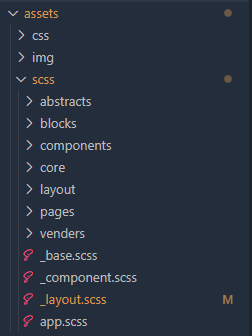

<!-- @format -->

# **CSS preprocessor - SCSS**

<br>

# **:rage: Background**

페이지가 많아지고, 추가하고 싶은 기능이 늘어나면서 점점 CSS를 관리하기가 어려워짐~~귀찮아짐~~을 느꼈다. 게다가 수년전 프론트개발을 할 때 비슷한 기능을 사용해 본 터라 도전해보기로[^1].

[^1]: Preprocessor를 찾다가 발견했는데, 내가 예전에 너무도 사랑했던 html 전처리기 `jade`가 PUG로 계승되었다더라. 다음은 PUG다.

<br>

# **:confused: Why?**

사실 내가 도입하고 싶었던 것은 sass 였지만, 알아보니 css와의 호환성과 PostCSS와의 호환성, 요새 잘나간다는 Dart와의 호환성 등을 고려하여 일단은 SCSS를 시도해보기로 결정[^2]. ~~하지만 언제든 갈아탈 준비가...~~

[^2]: 하지만 나는 여전히 jade와 sass의 그 더없이 깔끔하고 똑떨어지는 느낌을 버릴 수 없다. 그리고 코드의 모양만 놓고 보면, PUG와 sass가 훨씬 잘 어울리는데, 왜 scss를 선호들하시는지 잘 모르겠다.

<br>

# **:triumph: How**

## 1. Install

나중에 빌드시스템 구성할 때 도움이 될 것 같아 깔맞춤으로 로컬에서만 사용하던 Prettier도 함께 설치했다[^3]

```json
// terminal에서 다음을 실행.
npm i -D sass prettier
```

[^3]: 어렴풋하게 예상은 했었지만, 이분이 참 친절하게 잘 설명해 놓으셨더라. [ESLint, Prettier Setting, 헤매지 말고 정확히 알고 설정하자.](https://helloinyong.tistory.com/325)

## 2. Config

이번에 오만가지 것들을 함께 검색하게되면서 알게 된 사실인데... 이런 package류는 config를 잘 하는게 정말 중요한 것 같다. 내 몸에 맞는 시스템을 원클릭으로 구성하기 위해서는 npm의 package.json 파일을 정복하는 것이 제일 우선이다. ~~느낌상 이건 자동빌드/배포를 거쳐 컨테이너, 도커의 개념과도 이어지는 부분같다.~~

아래는 자그마치 꼬박 24시간에 걸친 실험 끝에 완성된 나의 첫번째 script.

```json
/* 
package.json 의 script 부분에 추가할 것.
- 설치시의 -D 옵션떄문에 devDependencies 영역에 패키지가 설치되었다.
*/

{
    "scripts": {
        "test": "echo 'hello world'",
        "sass:dev": "sass --watch --update --style=expanded assets/scss:assets/css",
        "start": "npm run sass:dev"
    },
    "devDependencies": {
        "prettier": "^2.8.3",
        "sass": "^1.57.1"
    }
}
```

## 3. Usage

이제 terminal에서 다음을 실행해주면, assets/scss에서 작업하고 저장한 파일을 그 순간 assets/css로 저장해준다.

중요) 파일명에 prefix로 '\_'을 붙이면 컴파일하지 않는다.

```json
npm run sass:dev
// 또는
npm run start
```

## 4. etc.

사실 위의 스크립트를 그대로 쓰려면 folder structure도 맞춰줘야 한다. 사실 다른 구성을 먼저 생각했었지만, 일단 지금으로선 제대로 작동하는 것만도 감사하다. 그리고 `@import`를 통해 서로간의 포함관계를 만들어서, 최종적으로 app.scss에 모든 기능이 모이도록 만들어야 한다.



이미지 안의 각 폴더에 대한 설명은 다음을 참조.

> **A Simple SCSS Architecture, and Best Practice**
>
> -   In the `Abstract` partial, there is a file with all the variables, mixins, and similar components.
> -   The `Core` partial contains files like typography, resets, and boilerplate code, used across the whole website. Once you write this code, there is no further overwriting.
> -   The `Components` partial contains styles for all components that are to be created for one website, including buttons, carousels, tabs, modals, and the like.
> -   The `Layout` partial has all styles necessary for the layout of the site, i.e., header, footer.
> -   The `Pages` partial contains the styles for every individual page. Almost every page needs to have specific styles that are to be used only for that particular page.
> -   For every section to be reusable and the sass code to be easily accessible, there is the `Section/Blocks` partial. Also, it is important to have this partial so that you don’t need to search whether particular code is in the home.sass or about.sass files in the Pages partial. It is a good idea to put each section in a separate .sass file. Thus, if you have two different hero sections, put the code in the same file to know that there you can find the code for the two sections. And if you follow this pattern, you will have the majority of files in this folder.
> -   The `Vendors` partial is intended for bootstrap frameworks so, if you use one in your project, create this partial.

<br>

# **Furder study**

-   [ ] PUG : 벌써부터 생각만해도 마음이 설레는...html preprocessor `jade`의 후손. 아무리 Emmet에 익숙하다고 해도, html을 한땀한땀 쳐서 통플젝을 진행하는 건 생각하기도 싫으니까.
-   [ ] eslint : 명불허전. 꼭 필요하지...
-   [ ] stylelint : eslint와 뭐가 다른지 잘 모르겠지만, 설명하기로는... 이건 코드컨벤션을 강제할 수 있는 기능도 있다~~카더라~~.
-   [ ] Browser sync : 나는 지금 VScode plugin인 live server를 너무 만족스럽게 사용하고 있어서 크게 필요성을 못느끼지만, [Designing in the Browser](https://pineco.de/designing-in-the-browser/)라는 신박한 방법을 찬양하는 한 블로그에서 stylelint와 함꼐 사용하고 있었다.
-   [ ] Frontend Architecture for web dev.
    -   [ ] [CSS Architecture with SASS, SMACSS, and BEM.](https://itnext.io/css-architecture-with-sass-smacss-and-bem-cc618392c148)
    -   [ ] [2-smartest-ways-to-structure-sass](https://www.webdesignerdepot.com/2020/12/2-smartest-ways-to-structure-sass/)
