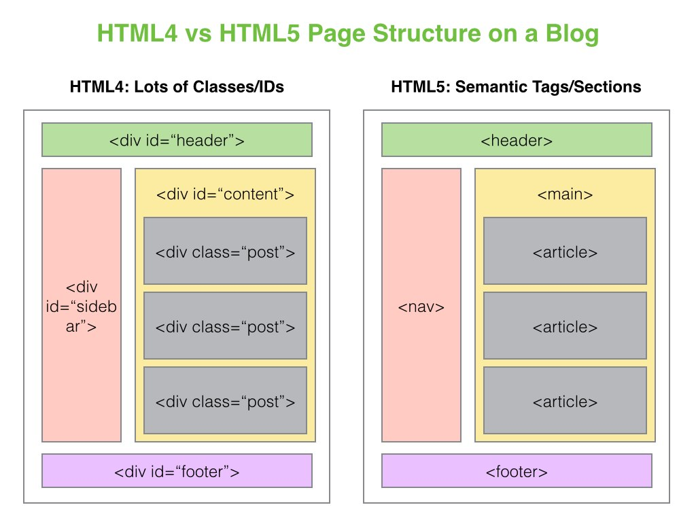
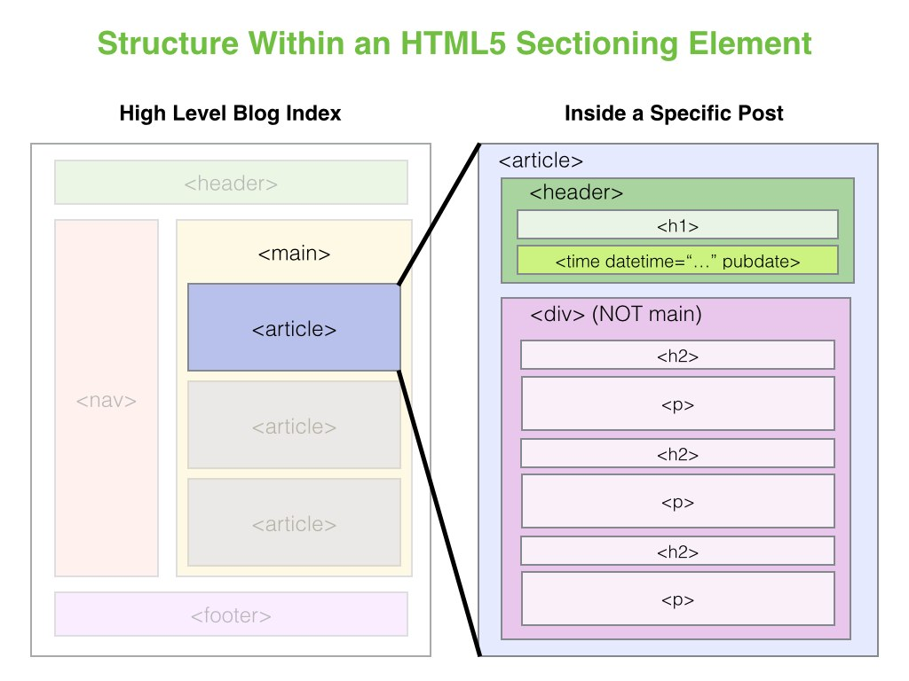

# What and why simantic?

html4에서 html5로 오면서 많은 변화가 있었는데, 그 중에 가장 중요한 것이 semantic tag가 추가되었다는 것이다. 별도의 설정을 하지 않아도(심지로 css가 없어도) 해당 문서의 골격이 파악될 수 있도록 마련한, 이를테면 '그룹핑'을 위한 tag인데, 왠만한 사이트 다 까봐도 semantic하게 코딩되어 있는 경우는 거의 볼 수 없다. 

semantic하게 문서를 코딩했을 경우 여러가지 꿀떨어지는 부수효과를 누릴 수 있기에... 왠만하면 따르도록 하자. 
- 단, 애매할 때는 시맨틱태그를 사용하지 않는다.

### 접근성이 좋아짐.
In this example, screen reading technology would announce that there are two <nav> sections, one called "Primary navigation" and one called "Footer navigation". If labels were not provided, the person using screen reading software may have to investigate each nav element's contents to determine their purpose.
```html
<header>
  <nav aria-labelledby="primary-navigation">
    <h2 id="primary-navigation">Primary navigation</h2>
    <!-- navigation items -->
  </nav>
</header>

<!-- page content -->

<footer>
  <nav aria-labelledby="footer-navigation">
    <h2 id="footer-navigation">Footer navigation</h2>
    <!-- navigation items -->
  </nav>
</footer>

```

### 유지보수가 편해진다
- 수정이 편해지고, 코드 가독성이 좋아진다. 
- 코드와 데이터의 재사용성이 높아진다. 

일단 다음 그림만 봐도... html4 때에 해당 요소를 특정하기 위해 갖은 노력을 했어야하는데에 반해, 오른쪽의 html5는 깔끔하게 태그 하나로 끝낼 수 있다.



### 봇들이 좋아한다.
봇의 눈에서 보면, 


```<header>``` (가장 위에 있는 경우) 화면 전체를 설명하거나, (섹션 내에 있는 경우) 섹션의 주제를 나타내는 요소. 
- ```<nav>``` 네비게이션.
- ```<main>``` 화면의 컨텐츠. 1개의 화면에서 1번만 사용한다.
  - ```<article>``` 다양한 콘텐츠 하위 섹션
    - ```<section>```
    - ```<div>```
- ```<aside>``` 사이드바. 주요 컨텐츠에 간접적으로 관련된 정보 또는 선택적으로 사용할 수 있는 요소를 넣음.(필요에 따라 ```<main>```내부에 배치되기도 함) 
- ```<footer>``` 푸터. 주로 사이트 운영주체에 대한 설명이나 SEO 대응을 위한 sitemap 으로 활용하기도 한다.
- 비의미적 래퍼 ```<div>, <span>```


```<hr>``` v. ```<br>``` 전자는 주제구분의 의미가 추가.

# 다음
- 헤딩을 사용한다. h1, h2 ~ 폰트크기 뿐만 아니라, 정보의 중요성까지도 알수 있게 됨.
- list 를 사용한다. - ol, ul, dl 관련있는 정보는 묶어서.
- form에 label을 사용한다. 
- 표현을 위한 태그를 사용하지 않는다. <i>, big, tt, center 등.
- 가급적 정보의 유형에 맞는 태그를 사용 <abbr>, <address>
- 표현을 위해 의미를 담은 태그를 오용하지 않는다. 즉 bold적용을 위해서 <strong>를 사용하지 않는다. 이건 강조니까.
- html 검사기를 활용한다. <https://validator.w3.org/>
